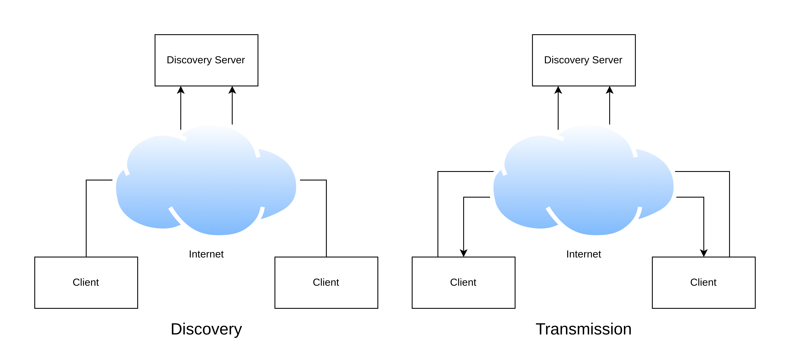

# YARD
Yet Another Remote Desktop

---

## Structure

## Installation

Basis:
- [Python min. v3.10](https://www.python.org/)
- TKinter
- PIP

### Windows

1. Install Python
2. Select on installation the options tcl and pip

### Linux

1. Install Python with package manager (apt, pacman, yum, ...)
2. Install TKinter

### YARD

1. Clone this repository
2. Open a terminal and cd into that directory
3. Run `pip install -r requirements.txt`
4. Enter the source/settings folder
5. On the server change the hostname to the address on which clients can connect to
    - For example "hostname": "192.168.48.152"
6. On the client enter the same address check if the server is reachable and open port tcp/13331 and udp/13333
7. Program is ready to be executed (source/client.py or source/server.py)